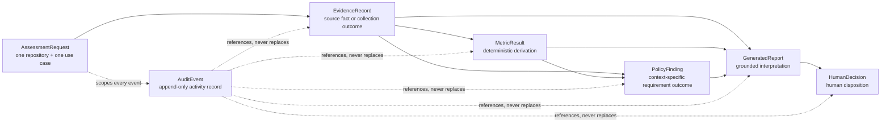

# Domain Model

## Status and Scope

This document defines the logical domain model for the planned Engineering Due
Diligence Platform. It is a design contract for later implementation, not a
description of working application behavior.

The model covers one assessment of one public GitHub repository for one
specified engineering use case. It does not define database tables, columns,
indexes, migrations, API payloads, Python classes, user interfaces, or
infrastructure.

The assessment decision is the core abstraction. Repository identity is an
input to an assessment, not a reusable verdict about repository quality.

## Domain Authority

Ownership means authority over the meaning or production of a record. It does
not imply that every owner may directly mutate persisted data.

| Domain concern | Authority |
| --- | --- |
| Use-case context | The Staff Software Engineer acting as the engineering reviewer supplies the context; deterministic validation decides whether it is complete and supported |
| Workflow state | Deterministic workflow software |
| Source facts | The authoritative external source; deterministic collectors capture and preserve what the source returned |
| Metrics | Versioned deterministic calculators |
| Policy findings | Versioned deterministic policy evaluation |
| Generated interpretation | The model may draft grounded explanations; deterministic software validates report structure, references, and deterministic grounding |
| Final adoption decision | An authorized human reviewer |
| Audit history | Append-only deterministic audit recording of domain activity |

The Platform Engineering Lead owns the shared workflow boundaries. The
Application Security Engineer owns security-policy input and required critical
dependency review. Exact policy-approval and reviewer-authorization matrices
remain unresolved and must be defined before implementation.

## Record and Identifier Conventions

The field names below are logical labels. They describe information that must
exist without choosing a storage or serialization representation.

All domain identifiers must be:

* opaque and globally unique within the platform;
* stable for the lifetime of the record;
* generated by deterministic application software, except identifiers copied
  from authoritative sources;
* unsuitable for encoding mutable business meaning; and
* preserved in every reference, generated claim, decision, and audit event.

The specific identifier algorithm is deferred. A repository URL, repository
numeric identifier, metric name, policy requirement, or content hash is not a
substitute for a domain record identifier.

Repeated work creates a new identifier and links to the prior record. It does
not reuse an identifier to overwrite history. Correlation and causation
identifiers group related attempts without changing record identity.

Every `prior_*` or `supersedes_*` reference must:

* point to the correct entity type;
* belong to the same `AssessmentRequest`;
* reference an authoritative record persisted earlier than its successor;
* never reference the successor itself; and
* never create a cycle.

Successor chains are append-only. Every earlier authoritative record remains
retrievable even when deterministic workflow logic selects a later record for
the current stage.

Unless stated otherwise:

* persisted timestamps identify an unambiguous instant and preserve their
  source where relevant;
* schema or definition versions are required for authoritative records;
* a conditionally required field becomes mandatory in the state or outcome
  named in its description; and
* persisted authoritative records are append-only.

## Operation and Authoritative Record Boundary

Workflow orchestration and authoritative domain records are related but
different:

* deterministic workflow orchestration owns transient activity such as
  requested, started, retrying, validating, and interrupted;
* an authoritative domain record begins to exist only when all fields required
  for one of its persisted outcomes are complete and durable;
* a terminal failed or unavailable outcome becomes an authoritative record only
  when the entity definition includes that outcome and its required failure
  information is complete;
* an operation that fails or is interrupted before it can create a complete
  authoritative record is represented by workflow state and `AuditEvent`
  records that reference the assessment and attempt identifier; and
* an `AuditEvent` records the activity but never substitutes for the completed
  domain record.

`AssessmentRequest` is the aggregate root and the one entity whose persisted
workflow state changes over time. Its submitted context remains immutable while
deterministic orchestration advances the workflow state.

## Core Invariants

1. One `AssessmentRequest` represents one repository in one assessment context.
2. A materially different use case, environment, criticality, expected
   lifetime, or risk tolerance requires a different assessment identity.
3. An `EvidenceRecord` must be durably stored before its identifier can be used
   by a `MetricResult`, `PolicyFinding`, or `GeneratedReport`.
4. Evidence records contain source facts and collection outcomes, not metrics,
   policy outcomes, generated interpretations, or adoption decisions.
5. Every `MetricResult` is deterministic for the same metric definition
   version and identical immutable evidence inputs.
6. Every `PolicyFinding` identifies the assessment context, policy version,
   evaluated requirement, outcome, and causing evidence or metric identifiers.
7. Every material claim accepted in a `GeneratedReport` references the exact
   input record appropriate to the claim: direct facts cite `EvidenceRecord`,
   metric-derived statements cite `MetricResult`, and policy conclusions cite
   `PolicyFinding`.
8. A `GeneratedReport` cannot create evidence, calculate authoritative metrics,
   enforce policy, change workflow state, or become a final decision.
9. Only a recorded `HumanDecision` can provide the assessment disposition.
10. Each assessment has at most one authoritative final `HumanDecision`.
    `request_further_investigation` is nonfinal and does not consume that final
    decision slot.
11. Recording the final decision, transitioning the assessment to `completed`,
    and recording the corresponding `AuditEvent` form one indivisible domain
    operation.
12. `AuditEvent` records activity involving domain records; it never replaces
    the records or becomes the only location for their required content.
13. Missing, failed, stale, or partial evidence remains explicit and can never
    be converted silently into a pass, zero-risk value, or favorable fact.
14. No entity contains or derives a universal repository quality score.

## Aggregate and Relationship Chain

`AssessmentRequest` is the aggregate root. Every downstream record belongs to
exactly one assessment, although each stage may produce multiple records or
attempts.

The primary dependency chain is:

`AssessmentRequest` → `EvidenceRecord` → `MetricResult` → `PolicyFinding` →
`GeneratedReport` → `HumanDecision`

The arrows mean “is an input to,” not “is embedded in” or “is overwritten by.”
A policy finding may use raw evidence directly, metric results, or both. A
report cites evidence for direct factual statements, metric results for
calculated statements, and policy findings for requirement outcomes. All
references stay within the assessment and the report's fixed input set.

## AssessmentRequest

### Purpose

`AssessmentRequest` captures the repository target, intended engineering use,
risk context, responsible reviewer, validation result, and deterministic
workflow state for one potential adoption decision.

It prevents a decision about one use case from becoming a general verdict about
the repository.

### Ownership

The Staff Software Engineer acting as the engineering reviewer owns the
accuracy of the submitted use-case context. Deterministic software owns request
validation, identifier assignment, and workflow-state transitions. Human or
model-generated text cannot directly set workflow state.

### Required Fields

| Logical field | Meaning |
| --- | --- |
| `assessment_id` | Stable identity of this assessment context |
| `submitted_repository_locator` | Exact public GitHub locator supplied by the reviewer |
| `normalized_repository_identity` | Deterministically resolved repository identity; required before `validated` |
| `intended_use` | Specific capability and role the repository would serve |
| `environment` | Runtime, deployment, and relevant operating context |
| `criticality` | Declared consequence or service criticality |
| `expected_lifetime` | Expected duration and lifecycle of use |
| `risk_tolerance` | Organizational tolerance applicable to this use |
| `submitted_by_actor_id` | Identity of the submitting Staff Software Engineer |
| `responsible_reviewer_actor_id` | Human accountable for recording the disposition |
| `submitted_at` | Time the request became immutable and entered validation |
| `validation_status` | `pending`, `valid`, or `invalid` |
| `workflow_state` | Current deterministic assessment lifecycle state |
| `request_definition_version` | Version of the context and validation definition |

When `workflow_state` is `interrupted`, the prior active state, interruption
reason, and resumability classification are also required.

At `submitted`, all required submitted-context fields, identities,
`submitted_at`, `validation_status=pending`, `workflow_state=submitted`, and
the request-definition version must be present.
`normalized_repository_identity` becomes required only when validation
succeeds. `validation_status=invalid` is valid only with
`workflow_state=validation_failed`; `validation_status=valid` is required for
`validated` and every later workflow state.

### Optional Fields

| Logical field | Meaning |
| --- | --- |
| `repository_source_id` | Stable GitHub repository identifier when authoritative resolution succeeds |
| `organizational_reference` | Ticket or engagement reference that does not define domain identity |
| `validation_errors` | Required when `validation_status` is `invalid` |
| `related_assessment_ids` | Earlier assessments linked for human navigation, including reassessment or corrected submission |
| `submitted_notes` | Reviewer context that does not replace required structured fields |

### Identifier Strategy

`assessment_id` is created once for one repository-and-context combination and
never reused. It is not derived from the repository URL. A corrected submitted
request or materially different context receives a new `assessment_id` and may
reference the earlier assessment.

### Lifecycle States

A pre-submission draft belongs to the request-entry operation and is not an
authoritative `AssessmentRequest`. The authoritative record begins at
`submitted`, when the complete submitted context, submitter, request-definition
version, and submission time are durable.

| State | Meaning |
| --- | --- |
| `submitted` | Submitted content is immutable and awaits deterministic validation |
| `validation_failed` | The submitted request is invalid or unsupported; terminal for this identity |
| `validated` | Required context and supported target are confirmed |
| `collecting_evidence` | Collection attempts are in progress or being completed |
| `deriving_metrics` | Stored evidence is being evaluated by versioned calculators |
| `evaluating_policy` | Versioned policy is being applied to context and facts |
| `generating_report` | A grounded report attempt is being generated and validated |
| `awaiting_human_review` | A valid report and its inputs are available for human review |
| `further_investigation_requested` | A human has requested specified additional evidence or analysis |
| `interrupted` | Processing stopped without invalidating completed records; prior active state is retained for resumption |
| `completed` | A final human decision is recorded for this assessment |

### Valid State Transitions

| From | To | Rule |
| --- | --- | --- |
| `submitted` | `validation_failed` | Deterministic validation records explicit errors |
| `submitted` | `validated` | Deterministic validation succeeds |
| `validated` | `collecting_evidence` | Collection plan and versions are recorded |
| `collecting_evidence` | `deriving_metrics` | Required attempts have terminal stored outcomes, including explicit failures or unavailability |
| `deriving_metrics` | `evaluating_policy` | Required calculation attempts have stored results or explicit unavailable/failure status |
| `evaluating_policy` | `generating_report` | Policy evaluation has a complete, stored set of findings |
| `generating_report` | `awaiting_human_review` | A generated report is `valid` only after structural, reference, and deterministic grounding validation all pass |
| `awaiting_human_review` | `further_investigation_requested` | An authorized human records that disposition and specifies the needed investigation |
| `further_investigation_requested` | `collecting_evidence` | Deterministic routing identifies evidence collection as the earliest affected stage |
| `further_investigation_requested` | `deriving_metrics` | Existing evidence is sufficient and deterministic routing identifies metric calculation as the earliest affected stage |
| `further_investigation_requested` | `evaluating_policy` | Existing evidence and metrics are sufficient and deterministic routing identifies policy evaluation as the earliest affected stage |
| `further_investigation_requested` | `generating_report` | Authoritative evidence, metrics, and policy findings remain valid and deterministic routing identifies report generation as the earliest affected stage |
| `awaiting_human_review` | `collecting_evidence` | Required evidence becomes unavailable or stale before decision; reason is audited |
| `awaiting_human_review` | `evaluating_policy` | An authorized policy-version change requires reevaluation |
| `awaiting_human_review` | `generating_report` | Explicit regeneration is requested without changing authoritative facts |
| `awaiting_human_review` | `completed` | The indivisible final-decision operation records one authorized final decision and its audit event |
| Any nonterminal execution state | `interrupted` | The interrupted stage, cause, and resumability are recorded |
| `interrupted` | Prior nonterminal state | Deterministic resumption uses completed records and does not repeat stages without an explicit reason |

No transition leaves `validation_failed` or `completed`. A corrected request,
different use case, or reassessment creates a related `AssessmentRequest`.

### Relationships

An assessment has zero or more evidence records, metric results, policy
findings, generated reports, human decisions, and audit events. It may have
related assessments, but their evidence and conclusions do not become inputs
unless they are recollected or explicitly represented within the new
assessment.

### Immutability Rules

Draft content may change before an authoritative request exists. The submitted
snapshot, identity, context, request-definition version, submitter, and
submission time are immutable once the `AssessmentRequest` begins at
`submitted`.

Workflow state may change only through valid deterministic transitions. Each
transition creates an `AuditEvent`; it does not rewrite the original submitted
context.

### Versioning Requirements

Preserve the request-definition and validation-rule versions used at
submission. A material context correction creates a new assessment rather than
a new version that mutates the original request.

### Audit Requirements

Record request creation, submission, validation result, every workflow
transition, interruption, resumption, investigation loop, final completion,
actor, time, correlation, and reason. Validation failures must remain
retrievable even though no downstream assessment is produced.

### Failure and Incomplete Data Behavior

Missing required context produces `validation_failed`; the system does not ask
AI to infer it. Collection, metric, policy, or report failures do not erase the
request or completed prior records. An interrupted assessment resumes from the
last incomplete stage. The interrupted operation is represented by workflow
state and audit activity, not by a partially valid downstream record. A
workflow may proceed with unavailable evidence only when downstream records
explicitly preserve that unavailability and policy permits human review.

## EvidenceRecord

### Purpose

`EvidenceRecord` preserves what an authoritative source returned, or the
explicit outcome when required evidence could not be obtained. It is the
traceable factual input to metrics, policy, and grounded reporting.

An evidence record does not express repository suitability.

### Ownership

The authoritative external source owns the meaning of source facts.
Deterministic collector software owns retrieval, normalization, outcome
classification, provenance capture, and persistence. AI cannot author,
complete, or correct an evidence record.

### Required Fields

| Logical field | Meaning |
| --- | --- |
| `evidence_id` | Stable identity of this stored collection outcome |
| `assessment_id` | Assessment for which the evidence was collected |
| `evidence_kind` | Defined category of expected source fact |
| `source_identity` | Authoritative source system and resource location |
| `collector_name` | Deterministic collector responsible for capture |
| `collector_version` | Version of retrieval and normalization behavior |
| `collection_attempt_id` | Identity shared by records and events for one attempt |
| `attempt_number` | Monotonic attempt number within the evidence kind and assessment |
| `attempted_at` | Time retrieval was attempted |
| `collection_outcome` | `available`, `partial`, `unavailable`, `failed_retryable`, or `failed_nonretryable` |
| `freshness_basis` | Source time, collection time, expiry, or explicit unknown basis |
| `freshness_status_at_collection` | `current`, `stale`, `unknown`, or `not_applicable` |
| `evidence_schema_version` | Version of normalized evidence structure |
| `provenance` | Information needed to identify and verify the source response |

For `available` and `partial` outcomes, a raw response or durable relevant
source snapshot reference and its integrity digest are also required. For
`unavailable` or failed outcomes, an explicit reason and error category are
required instead.

### Optional Fields

| Logical field | Meaning |
| --- | --- |
| `source_observed_at` | Time the source says the fact was produced or updated |
| `expires_at` | Time after which a declared freshness rule treats the record as stale |
| `freshness_rule_version` | Rule used to establish freshness at collection when a deterministic freshness rule is applied |
| `source_revision` | Source-native revision, ETag, commit, or equivalent |
| `response_metadata` | Relevant transport or source metadata with secrets excluded |
| `missing_components` | Required for `partial` when known |
| `prior_evidence_id` | Earlier record this recollection follows |
| `retry_after` | Source-provided or deterministic retry guidance |

### Identifier Strategy

Every collection attempt outcome receives a new `evidence_id`, including
failed, unavailable, partial, or byte-identical recollections. The
`collection_attempt_id` groups activity for one attempt. `prior_evidence_id`
links recollections without replacing earlier provenance.

### Lifecycle States

`started` is a collection-operation state owned by workflow orchestration, not a
persisted state of `EvidenceRecord`. The authoritative evidence record begins
only when one terminal `collection_outcome`, all universally required fields,
and all outcome-specific fields are durably stored.

The persisted record has one state, `recorded`. Its immutable
`collection_outcome` distinguishes `available`, `partial`, `unavailable`,
`failed_retryable`, and `failed_nonretryable`.

Freshness is a separate dimension, not a lifecycle state. A stored record may
be current at collection and stale when later used, based on its immutable
timestamps and the versioned freshness rule.

### Valid State Transitions

| Operation state | Terminal persisted outcome | Rule |
| --- | --- | --- |
| `started` | `available` | Complete required source content is captured and stored |
| `started` | `partial` | Some source content is captured and omissions are explicit |
| `started` | `unavailable` | The source confirms absence, unsupported access, or no applicable record |
| `started` | `failed_retryable` | A transient retrieval failure is classified and stored |
| `started` | `failed_nonretryable` | A permanent or unsupported failure is classified and stored |

These are operation transitions that create a complete authoritative record;
they are not mutations between persisted evidence states. A retry starts a new
attempt and creates a new evidence record when it reaches a terminal outcome.
An attempt interrupted before a terminal outcome creates no partial
`EvidenceRecord`; workflow state and audit events preserve the attempt and
interruption.

### Relationships

Every evidence record belongs to one assessment. Zero or more metric results,
policy findings, and generated-report claims may reference it. A recollection
may reference one prior evidence record, and audit events reference its
collection and persistence activity.

### Immutability Rules

Raw responses or source snapshots, integrity digests, source identity,
collection outcome, provenance, timestamps, collector version, and normalized
content cannot be changed after storage. A correction, retry, or recollection
creates a new record.

Secrets and unrelated personal data must not be preserved as evidence merely
because a source response contains them. The later collector design must define
the minimum retained snapshot while preserving authoritative facts and
provenance.

### Versioning Requirements

Preserve collector version, evidence schema version, source revision where
available, and any freshness rule used at collection. A new normalization rule
does not rewrite old evidence; it requires recollection or a separately
versioned derivation from the retained raw snapshot.

### Audit Requirements

Record attempt start, source targeted, collector version, outcome, retry
classification, storage completion, integrity validation, actor or system
component, and correlations to prior attempts. Audit metadata cannot substitute
for the evidence payload, explicit absence reason, or provenance.

### Failure and Incomplete Data Behavior

* `failed_retryable` permits a new attempt according to bounded retry rules.
* `failed_nonretryable` prevents automatic retry until an input or support
  condition changes.
* `unavailable` represents known absence or inability to obtain the required
  fact, not a favorable result.
* `partial` preserves captured content and names known omissions.
* Freshness at collection is the immutable status observed or calculated when
  evidence is stored. Freshness at use is a later deterministic evaluation
  performed for a metric calculation or policy evaluation. The two must not be
  treated as the same fact.
* Whenever freshness affects a metric or policy result, the consuming record
  preserves the evidence identifier, freshness status used, freshness
  evaluation timestamp, and freshness rule version.
* A later freshness-rule change never rewrites this record or a historical
  metric or policy result.
* If an expected evidence kind has no usable content, downstream results must
  be unavailable, not evaluable, lower confidence, or require investigation as
  defined by deterministic rules.

## MetricResult

### Purpose

`MetricResult` records a deterministic, independently testable derivation from
stored evidence. It represents one metric calculation for this assessment, not
a policy judgment or adoption recommendation.

### Ownership

Versioned deterministic metric software owns metric definitions, input
validation, calculation, availability classification, and output. AI and human
reviewers may explain or challenge a metric but cannot authoritatively
calculate or mutate it.

### Required Fields

| Logical field | Meaning |
| --- | --- |
| `metric_result_id` | Stable identity of this calculation result |
| `assessment_id` | Assessment receiving the result |
| `calculation_attempt_id` | Identity of the transient operation that produced this authoritative result |
| `metric_name` | Stable semantic name of the metric |
| `metric_definition_version` | Exact calculation definition used |
| `input_evidence_ids` | Ordered or canonically represented set of stored evidence inputs |
| `input_digest` | Integrity digest of the canonical calculation inputs |
| `calculated_at` | Time the calculation completed |
| `result_status` | `available`, `unavailable`, or `failed` |
| `availability_or_confidence_status` | Deterministic statement of input sufficiency |
| `metric_schema_version` | Version of the result structure |

For `available`, the typed metric value and unit or scale are required. For
`unavailable` or `failed`, an explicit reason code is required and no
placeholder numeric value is allowed.

Whenever freshness affects the calculation, `input_freshness_evaluations` is
also required. For each affected input it preserves:

1. `evidence_id`;
2. `freshness_status_used`;
3. `freshness_evaluated_at`; and
4. `freshness_rule_version`.

### Optional Fields

| Logical field | Meaning |
| --- | --- |
| `calculation_run_id` | Grouping identifier for metrics calculated in one workflow run |
| `supersedes_metric_result_id` | Earlier result replaced for current review by explicit recalculation |
| `warnings` | Deterministic qualifications that do not change the value |
| `failure_details` | Sanitized detail for a failed calculation |

### Identifier Strategy

Every persisted calculation attempt receives a new `metric_result_id`.
Identical inputs and definition versions must yield equivalent result content,
but the platform may reuse a previously verified result rather than calculate
again. Reuse is audited and does not create a conflicting result.

### Lifecycle States

`started` is a calculation-operation state owned by workflow orchestration, not
a persisted `MetricResult` state. An authoritative metric result begins only
when the calculation has a terminal `result_status` and all required fields for
that status are durable.

The persisted record has one state, `recorded`. Its immutable `result_status`
distinguishes `available`, `unavailable`, and `failed`. An explicitly
recalculated result may supersede it for current review through a successor
reference without mutating the earlier record.

### Valid State Transitions

| Operation state | Terminal persisted result | Rule |
| --- | --- | --- |
| `started` | `available` | Inputs are sufficient and deterministic calculation succeeds |
| `started` | `unavailable` | Required evidence is missing, stale beyond policy, partial, or otherwise insufficient |
| `started` | `failed` | Calculator execution or input validation fails unexpectedly |

These operation transitions create complete records; no persisted result
transitions to another outcome. An interruption before a terminal result is
represented by workflow state and audit events using
`calculation_attempt_id`, not by a partial `MetricResult`. Recalculation is a
new attempt.

### Relationships

A metric result belongs to one assessment, references one or more stored
evidence records, and may be referenced by one or more policy findings or
generated report claims. It may link to an earlier metric result that it
supersedes for the active review.

### Immutability Rules

Inputs, definition version, value, unit, availability, reason, input digest,
and calculation timestamp are immutable after persistence. A defect fix,
definition change, input change, or explicit recalculation creates a new
result.

### Versioning Requirements

The metric definition version and result schema version are required. Every
freshness rule that affected the result is preserved with its at-use
evaluation. A calculation-version or freshness-rule change must not silently
alter historical results. If the same evidence is recalculated under a new
version, both results remain retrievable and the successor states why
recalculation occurred.

### Audit Requirements

Record calculation start, input identifiers, definition version, terminal
status, reuse or recalculation reason, result identifier, and failure category.
The audit event does not contain the metric value in place of the
`MetricResult`.

### Failure and Incomplete Data Behavior

Missing, stale, partial, unavailable, or failed evidence produces an explicit
`unavailable` result when the metric cannot be validly calculated. It never
produces zero, false, or a guessed value. Calculator defects produce `failed`
and block dependent policy evaluation until deterministic workflow rules
resolve or explicitly represent the failure. An interrupted calculation that
has no complete terminal result produces audit activity but no authoritative
metric record.

## PolicyFinding

### Purpose

`PolicyFinding` records the deterministic result of evaluating one explicit,
versioned policy requirement against the assessment context, evidence, and
metrics.

It expresses a context-specific requirement outcome, not a universal repository
score and not the final adoption decision.

### Ownership

Organizational policy owners define and approve policy content. Under the
current charter, the Platform Engineering Lead owns workflow governance and the
Application Security Engineer owns security-policy input. The exact approval
matrix remains to be defined.

Versioned deterministic policy software owns evaluation. AI cannot enforce,
waive, or alter policy. Only authorized humans may act on findings within the
decision process.

### Required Fields

| Logical field | Meaning |
| --- | --- |
| `policy_finding_id` | Stable identity of this requirement evaluation |
| `assessment_id` | Context against which the requirement was evaluated |
| `policy_id` | Stable identity of the policy set |
| `policy_version` | Exact approved policy version |
| `policy_engine_version` | Exact deterministic evaluator version |
| `policy_evaluation_id` | Grouping identity for one evaluation of a policy set |
| `requirement_id` | Stable identity of the evaluated requirement |
| `requirement_version` | Version of requirement semantics when separate from policy version |
| `outcome` | `pass`, `fail`, `condition_required`, `investigation_required`, or `not_evaluable` |
| `input_evidence_ids` | Evidence used directly by the requirement |
| `input_metric_result_ids` | Metric results used by the requirement |
| `deterministic_reason` | Rule-controlled explanation or reason code |
| `evaluated_at` | Time evaluation completed |
| `finding_schema_version` | Version of the finding structure |

At least one input evidence or metric identifier is required unless the finding
is caused solely by missing a defined required input. In that case, the
required evidence kind and explicit unavailability reference are required.

Whenever freshness affects the evaluation, `input_freshness_evaluations` is
also required. For every affected evidence input it preserves:

1. `evidence_id`;
2. `freshness_status_used`;
3. `freshness_evaluated_at`; and
4. `freshness_rule_version`.

This includes freshness used directly by the policy requirement and freshness
in a referenced metric on which the outcome relies.

### Optional Fields

| Logical field | Meaning |
| --- | --- |
| `condition_template` | Deterministic condition required by policy; not a human final condition |
| `required_reviewer_roles` | Roles policy requires to participate |
| `supersedes_policy_finding_id` | Corresponding earlier finding from a prior evaluation |

### Identifier Strategy

Every requirement evaluation receives a new `policy_finding_id`.
`policy_evaluation_id` groups the complete finding set produced under one policy
version and input set. Requirement identity remains stable across compatible
policy versions; changed semantics require a version change.

### Lifecycle States

`started` is a policy-evaluation operation state owned by workflow
orchestration, not a persisted `PolicyFinding` state. An authoritative finding
begins only when one allowed outcome, all input references, all required
versions, and the deterministic reason are durable.

The persisted record has one state, `recorded`. Its immutable `outcome`
distinguishes the five requirement results. An engine execution error is a
failed workflow activity and does not create a partial finding or become
`fail` or `not_evaluable`.

### Valid State Transitions

| Operation state | Terminal persisted outcome | Rule |
| --- | --- | --- |
| `started` | `pass` | Facts satisfy the versioned requirement |
| `started` | `fail` | Facts deterministically violate the requirement |
| `started` | `condition_required` | Policy permits review only with an explicit condition |
| `started` | `investigation_required` | Policy requires additional human or evidence work |
| `started` | `not_evaluable` | Required facts are explicitly unavailable or insufficient |

These operation transitions create complete findings; no persisted outcome
transitions to another outcome. An interruption or engine failure before a
terminal outcome is represented by workflow state and audit events using
`policy_evaluation_id`. A policy or input change creates a new evaluation and
new findings.

### Relationships

A policy finding belongs to one assessment and one policy evaluation. It
references evidence, metrics, or explicit unavailable required inputs. It may
be cited by generated report claims and reviewed by a human decision.

### Immutability Rules

Policy identity and version, requirement, outcome, inputs, deterministic reason,
required roles, and timestamp are immutable after persistence. Waivers or human
exceptions are recorded in `HumanDecision` rationale or conditions and do not
rewrite policy history.

### Versioning Requirements

Preserve policy, requirement, policy-engine, finding-schema, and every
freshness-rule version needed to reproduce the result. A policy change creates
a new `policy_evaluation_id`. Earlier findings and the report based on them
remain available.

If policy changes after an assessment reaches `completed`, the historical
decision is not rewritten. Applying new policy requires a new related
assessment.

### Audit Requirements

Record evaluation start and completion, policy and requirement versions, input
identifiers, outcome, required reviewers, supersession links, and execution
failures. A policy content change must have its own governed history outside
the finding and cannot be hidden in generated narrative.

### Failure and Incomplete Data Behavior

Unavailable or insufficient facts yield `not_evaluable`,
`investigation_required`, or another explicitly defined conservative outcome.
They never yield `pass` by omission. A policy-engine failure blocks report
generation; it is not converted to a favorable or unfavorable finding. Human
review may accept a policy-defined condition but may not make the AI waive a
finding. An interrupted or failed evaluation with no complete terminal outcome
produces audit activity but no authoritative `PolicyFinding`.

## GeneratedReport

### Purpose

`GeneratedReport` preserves one AI-assisted report-generation attempt,
including its exact inputs, output, model and prompt versions, deterministic
validation result, evidence grounding, uncertainty, and reviewer questions.

The report supports a decision. It is not authoritative evidence, a metric
calculator, a policy engine, workflow controller, or decision maker.

### Ownership

The model produces candidate narrative and structured content. Deterministic
report software owns input assembly, schema validation, reference validation,
acceptance status, persistence, and workflow handoff. Human reviewers own how
the accepted report informs their decision.

### Required Fields

| Logical field | Meaning |
| --- | --- |
| `generated_report_id` | Stable identity of this generation attempt |
| `assessment_id` | Assessment being explained |
| `generation_attempt_id` | Correlation identity for the generation activity |
| `input_assessment_context_digest` | Integrity digest of the immutable assessment context supplied |
| `input_evidence_ids` | Evidence records available to the report |
| `input_metric_result_ids` | Metric results supplied to the report |
| `input_policy_finding_ids` | Policy findings supplied to the report |
| `report_schema_version` | Required structured output schema version |
| `prompt_version` | Exact prompt-template version |
| `model_identifier` | Provider/model identity used for generation |
| `model_configuration` | Reproducibility-relevant generation configuration |
| `generated_at` | Time the model output was produced |
| `validation_status` | `valid` or `unusable` after deterministic checks |
| `structural_validation_status` | `passed`, `failed`, or `not_run` for report-schema validation |
| `reference_validation_status` | `passed`, `failed`, or `not_run` for reference identity and fixed-input membership |
| `deterministic_grounding_validation_status` | `passed`, `failed`, or `not_run` for mechanically verifiable claim-to-record consistency |
| `raw_model_output_reference` | Preserved exact candidate output when the provider returns one |
| `report_content` | Structured content when valid; unusable output remains preserved separately |
| `claim_references` | Typed exact input-record identifiers supporting each material claim |
| `report_definition_version` | Version of input assembly and acceptance rules |

For a provider failure that returns no candidate output, explicit sanitized
failure details are required instead of `raw_model_output_reference`.

Each material claim must use the reference type appropriate to the claim:

* a direct evidence statement cites the exact `EvidenceRecord`;
* a metric-derived statement cites the exact `MetricResult`; and
* a policy conclusion cites the exact `PolicyFinding`.

Every cited identifier must belong to this report's fixed input set, reference
the same assessment, and resolve to the expected entity type.

`validation_status` may equal `valid` only when
`structural_validation_status`, `reference_validation_status`, and
`deterministic_grounding_validation_status` all equal `passed`. If any required
validation is `failed` or `not_run`, the report is `unusable` and cannot
proceed to human review as a valid decision brief.

### Validation Boundaries

Report acceptance separates four checks:

1. **Structural validation** deterministically checks the approved report
   schema, required fields, and claim-reference shape.
2. **Reference validation** deterministically confirms that every identifier
   exists, belongs to the same assessment, has the expected entity type, and is
   included in the fixed report input set.
3. **Deterministic grounding validation** checks mechanically verifiable
   consistency, such as exact metric values and units, policy outcomes, direct
   evidence facts, and required uncertainty markers.
4. **Human semantic review** occurs only after all three deterministic checks
   pass. It evaluates whether the cited records actually support broader
   explanations, tradeoffs, and operational consequences that deterministic
   rules cannot judge.

The model does not perform or approve any of these checks on its own output.
Deterministic software owns the first three. An authorized human owns semantic
review. Human review may reject or question a deterministically valid report or
request further investigation. A human finding an unsupported material claim
makes that report ineligible for the current decision and triggers
investigation or regeneration; it does not mutate the report.

### Optional Fields

| Logical field | Meaning |
| --- | --- |
| `supersedes_generated_report_id` | Earlier report followed by this regeneration |
| `reviewer_questions` | Grounded questions produced for human review |
| `uncertainties` | Missing, stale, partial, disputed, or otherwise limited evidence called out by the report |
| `validation_errors` | Required when `validation_status` is `unusable` |
| `provider_request_id` | External correlation identifier without credentials or secrets |

### Identifier Strategy

Every generation attempt receives a new `generated_report_id`, including invalid
or byte-identical output. Regeneration never overwrites a prior report.

### Lifecycle States

`requested` and `generated` are report-generation operation states owned by
workflow orchestration, not persisted states of `GeneratedReport`. An
authoritative report record begins only after the operation reaches `valid` or
`unusable` and all fields required for that outcome are durable.

The persisted record has one state, `recorded`. Its immutable
`validation_status` distinguishes `valid` and `unusable`. A provider failure
may produce a complete `unusable` record with `not_run` validation statuses and
required failure details. Only a `valid` report may move the assessment to
human review.

### Valid State Transitions

| Operation state | Next operation or terminal result | Rule |
| --- | --- | --- |
| `requested` | `generated` | Candidate output and model metadata are preserved |
| `requested` | `unusable` | Provider or generation failure is preserved |
| `generated` | `valid` | Structural, reference, and deterministic grounding validation all pass |
| `generated` | `unusable` | Any required validation is `failed` or `not_run` |

These operation transitions create a complete terminal record at `valid` or
`unusable`. An interruption before either terminal result is represented by
workflow state and audit events using `generation_attempt_id`, not by a partial
`GeneratedReport`. Regeneration creates a new report linked to the earlier
attempt.

### Relationships

A report belongs to one assessment and references the exact immutable
assessment context, evidence, metrics, and policy findings supplied to it. A
human decision references the valid report reviewed. Audit events reference
generation, validation, regeneration, and review handoff activity.

### Immutability Rules

Inputs, versions, model identifier and configuration, raw output, structured
content, validation result, claim references, and generation time are immutable
after persistence. Human edits are not silently folded into model output; any
human-authored rationale belongs in `HumanDecision`.

### Versioning Requirements

Preserve report schema, report definition, prompt, model identifier, relevant
model configuration, and exact input record identifiers. AI output is not
assumed to be byte-for-byte reproducible. Auditability is achieved by
preserving the actual input set and exact generated output.

Regeneration after any input, policy, prompt, schema, model, or reviewer request
change creates a new report and records the reason.

### Audit Requirements

Record generation request, fixed input set, prompt and model versions, provider
outcome, output persistence, all three deterministic validation results, human
semantic review outcome, unresolved references, regeneration reason, and report
selected for human review. Audit events do not replace the exact model output
or structured report.

### Failure and Incomplete Data Behavior

The report must state uncertainty caused by missing, stale, partial, failed, or
disputed evidence. It may explain that a metric is unavailable or a policy
finding is not evaluable; it may not fill the gap.

Provider failures and unsupported claims detected by deterministic validation
produce an `unusable` report. Deterministic software either performs a bounded,
audited regeneration or stops the stage. It never accepts malformed output
merely to continue the workflow.

If human semantic review finds an unsupported claim in a deterministically
valid report, the immutable report becomes ineligible as the current decision
input and the result is audited; investigation or regeneration follows. An
interrupted generation with no complete terminal result produces audit activity
but no authoritative report. The model cannot mark its own report valid or
override failed grounding or human semantic review.

## HumanDecision

### Purpose

`HumanDecision` records an authorized person’s disposition for the assessment,
their rationale, conditions or investigation request, and the report and
findings they reviewed.

It is the only domain entity that can record adoption approval or rejection.

### Ownership

An authorized human reviewer owns the disposition and rationale. The Staff
Software Engineer is the responsible engineering reviewer; criticality and
policy may require participation from the Application Security Engineer and
Engineering Manager. Deterministic software validates identity,
authorization, required participation, allowed disposition, and required
fields before recording the decision.

The AI model cannot select, submit, or approve a `HumanDecision`.

### Required Fields

| Logical field | Meaning |
| --- | --- |
| `human_decision_id` | Stable identity of the recorded human action |
| `assessment_id` | Assessment receiving the disposition |
| `decision_submission_id` | Stable idempotency identity supplied for one logical human decision submission |
| `disposition` | `approve`, `approve_with_conditions`, `request_further_investigation`, or `reject` |
| `decision_maker_actor_id` | Authorized human who records the decision |
| `decision_maker_role` | Role under which authority is exercised |
| `participating_reviewer_actor_ids` | Required human participants confirmed by policy |
| `reviewed_generated_report_id` | Valid report used for review |
| `reviewed_policy_evaluation_id` | Policy evaluation considered |
| `rationale` | Human-authored explanation for the disposition |
| `recorded_at` | Time the decision became authoritative |
| `decision_schema_version` | Version of allowed dispositions and required content |
| `authorization_rule_version` | Version of rules establishing who may decide |

For `approve_with_conditions`, structured conditions are required. For
`request_further_investigation`, a structured investigation request containing
the human's question, concern, affected conclusion, and known evidence need is
required.

### Optional Fields

| Logical field | Meaning |
| --- | --- |
| `conditions` | Required for conditional approval; each condition states the obligation, owner, and verification criterion known at decision time |
| `investigation_request` | Required for further investigation; records the question, concern, affected conclusion, and known evidence need |
| `cited_evidence_ids` | Evidence the human cites directly in addition to the reviewed report |
| `cited_policy_finding_ids` | Findings emphasized in the rationale |
| `related_prior_human_decision_id` | Earlier nonfinal investigation request followed by this decision |

### Identifier Strategy

Every new logical disposition receives a new `human_decision_id` and
`decision_submission_id`. Replaying the same `decision_submission_id` for the
same assessment and identical content returns or references the existing
decision; it does not create another authoritative record. Reusing that
identifier with different content fails validation.

A request for further investigation remains a permanent nonfinal human decision
record. A later logical submission receives another identifier and links to it.

### Lifecycle States

A decision draft and a received submission are human-review operation states,
not persisted `HumanDecision` states. An authoritative human decision begins
only after deterministic identity, authorization, participation, reference,
idempotency, and disposition-specific validation succeeds and all required
fields are durable.

The persisted record has one state, `recorded`. Finality is determined by its
immutable disposition.

A recorded `request_further_investigation` is nonfinal for the assessment.
Recorded `approve`, `approve_with_conditions`, and `reject` are final for that
assessment.

### Valid State Transitions

| Operation state | Terminal result | Rule |
| --- | --- | --- |
| `submission_received` | Authoritative `recorded` decision | Human identity, authority, participation, rationale, references, idempotency, and disposition-specific fields validate |
| `submission_received` | Rejected submission | Required validation fails; no partial `HumanDecision` is created |
| Replayed `decision_submission_id` | Existing recorded decision | Assessment and content match the existing logical submission |
| Recorded investigation request | New recorded decision | A later distinct submission follows affected workflow stages and human review; the old nonfinal record is linked, not changed |

There is no transition that changes a recorded disposition. Administrative
correction or materially changed facts require a new related assessment unless
a later ADR defines a narrowly governed correction procedure.

Each assessment may have at most one authoritative final decision. Recording
that final `HumanDecision`, transitioning the `AssessmentRequest` from
`awaiting_human_review` to `completed`, and persisting the corresponding
`AuditEvent` are one indivisible domain operation. This is a logical atomicity
requirement and does not select database transaction syntax.

A replay of the same logical final submission returns or references the
existing decision. A different final submission after `completed` fails and
must not create another authoritative `HumanDecision`. Nonfinal investigation
requests do not violate the one-final-decision invariant.

### Relationships

A human decision belongs to one assessment and references the valid generated
report and policy evaluation actually reviewed. It may cite evidence and
findings directly. A nonfinal investigation request may be followed by a later
decision in the same assessment. Deterministic workflow orchestration reads its
structured question, concern, and affected conclusion to select the earliest
affected stage; the human does not set workflow state.

### Immutability Rules

Recorded disposition, rationale, reviewer identities, participation, reviewed
versions, conditions, investigation requests, and timestamp are immutable.
Neither system automation nor AI may edit them.

Conditions are preserved as decision-time commitments. Automated condition
monitoring or remediation is outside scope; the platform must not claim those
capabilities merely because conditions are recorded.

### Versioning Requirements

Preserve decision schema and authorization-rule versions, plus the exact report
and policy evaluation reviewed. A final decision is not recomputed when policy,
evidence, or a repository later changes. Reassessment creates a new linked
assessment and decision history.

### Audit Requirements

Record review availability, reviewer access, authorization result, required
participation, decision submission identity, submission acceptance or
rejection, idempotent replay, recorded disposition, rationale presence,
condition or investigation presence, and assessment transition. The complete
decision content remains in `HumanDecision`, not only in audit metadata.

### Failure and Incomplete Data Behavior

If required reviewers, rationale, conditions, investigation details, report,
policy version, or authorization are missing, deterministic software rejects
recording, creates no partial human-decision record, and leaves the assessment
awaiting review. A conflicting final submission after completion is rejected
without creating a second final decision. Missing evidence may lead the human
to request investigation or make another allowed disposition where policy
permits; the model cannot resolve the gap.

An approval with conditions is final for this assessment and must name the
conditions explicitly. It is not equivalent to unconditional approval.

## AuditEvent

### Purpose

`AuditEvent` is an append-only record that a workflow action, transition,
attempt, validation, review, or failure occurred. It answers who or what did
what, when, to which domain record, and with what outcome.

Audit events support traceability and reconstruction but do not replace
`AssessmentRequest`, `EvidenceRecord`, `MetricResult`, `PolicyFinding`,
`GeneratedReport`, or `HumanDecision`.

### Ownership

Deterministic audit software owns event creation, ordering metadata, integrity,
and persistence. The actor named by an event may be a human, system component,
collector, or model provider, but that actor cannot rewrite the event after it
is stored.

### Required Fields

| Logical field | Meaning |
| --- | --- |
| `audit_event_id` | Stable identity of the event |
| `assessment_id` | Assessment whose activity is recorded |
| `event_type` | Versioned semantic type of activity |
| `occurred_at` | Time the activity occurred |
| `recorded_at` | Time the audit record became durable |
| `actor_type` | Human, deterministic component, collector, or model provider |
| `actor_id` | Identified actor or component version |
| `entity_type` | Domain record type affected or referenced |
| `entity_id` | Specific domain record identity |
| `action` | Activity performed |
| `outcome` | Success, rejection, failure, interruption, or other defined result |
| `workflow_stage` | Assessment stage in which the activity occurred |
| `correlation_id` | Groups activity belonging to one workflow operation |
| `audit_schema_version` | Version of the event structure and semantics |

For a workflow transition, the prior state, next state, and transition reason
are required. For a failure, the retry classification and sanitized error
category are required.

### Optional Fields

| Logical field | Meaning |
| --- | --- |
| `causation_event_id` | Earlier event that directly caused this activity |
| `attempt_id` | Collection, calculation, evaluation, or generation attempt identity |
| `trace_id` | Observability correlation that does not replace audit identity |
| `policy_version` | Policy version relevant to the activity |
| `metadata` | Minimal nonauthoritative context with secrets and raw evidence excluded |

### Identifier Strategy

Every event receives a new `audit_event_id`. Event identity is independent from
domain record and observability trace identities. Correlation and causation
links establish sequence without encoding it into the identifier.

### Lifecycle States

`created` is an audit-write operation state, not a persisted `AuditEvent`
state. An authoritative event begins only when every required field is complete
and the event is durable. The persisted record has one terminal state,
`recorded`.

If event persistence fails, no partial authoritative `AuditEvent` exists. The
owning domain operation is not acknowledged as auditable and must be retried or
failed safely.

### Valid State Transitions

| Operation state | Terminal persisted result | Rule |
| --- | --- | --- |
| `created` | Authoritative `recorded` event | Required fields and referential checks pass and the event is durably recorded |

A recorded event is never edited or deleted through the assessment workflow.
A correction is a new event that references the erroneous event.

### Relationships

Every audit event belongs to one assessment and references at least one domain
record. When an operation has not yet produced its authoritative downstream
record, the event references the `AssessmentRequest` and the operation's
attempt identifier. Events may reference prior events through causation. They
provide an activity history alongside, not instead of, the authoritative
record chain.

### Immutability Rules

All persisted audit fields are immutable. An audit event must not contain the
only copy of raw evidence, a metric value, policy rationale, generated report,
human rationale, or condition.

### Versioning Requirements

Preserve the audit schema and event-type semantic versions. Consumers must be
able to interpret historical events according to the version under which they
were recorded. Version changes never rewrite prior events.

### Audit Requirements

Audit events are themselves subject to integrity, ordering, access, and
retention controls. The later implementation must detect gaps between a domain
state change and its required audit event. The storage mechanism and retention
period are not selected in this document.

### Failure and Incomplete Data Behavior

An audit write failure cannot be silently ignored. A workflow-changing
operation is complete only when its authoritative domain record and required
audit activity are durable. Recovery must be idempotent and must not duplicate
the business operation merely to repair an audit gap.

An event with missing actor, entity, time, action, or outcome is invalid. An
observability trace may assist diagnosis but cannot fill an incomplete audit
record.

## Cross-Cutting Scenario Behavior

### 1. Failed Evidence Collection

Each attempt creates a stored `EvidenceRecord` with
`failed_retryable` or `failed_nonretryable`, an error category, collector
version, attempt identity, and provenance that is available. Bounded retry
creates a new attempt and record. Downstream stages see explicit failure; they
do not infer a source fact.

### 2. Missing Evidence

Expected but absent evidence is represented by `unavailable` evidence with an
explicit reason. Dependent metrics become unavailable. Policy produces
`not_evaluable`, `investigation_required`, or another explicitly defined
conservative result. Generated reports identify the gap and its consequence.

### 3. Stale Evidence

Freshness at collection remains an immutable property of the evidence record.
Freshness at use is separately determined from immutable evidence timestamps
and a versioned freshness rule during each consuming metric calculation or
policy evaluation. The consumer preserves the evidence identifier, status
used, evaluation timestamp, and rule version. Deterministic workflow either
recollects stale evidence or carries the explicit at-use stale status into
metrics, policy findings, and report uncertainty. Historical results remain
reproducible when freshness rules later change.

### 4. Partial Evidence

Captured content is stored with `partial`, the known omissions, raw snapshot,
and provenance. Calculators and policies may use only the portion their
versioned definitions explicitly support. No component may describe partial
evidence as complete.

### 5. Recollection Attempts

Recollection creates a new collection attempt and `EvidenceRecord`, links the
prior evidence where applicable, and preserves all earlier successes and
failures. Current-stage input selection is deterministic, versioned, and
audited. The predecessor link follows the same-assessment, earlier-record, and
acyclic successor invariants.

### 6. Metric Recalculation

Recalculation requires an explicit trigger such as changed evidence, corrected
calculator logic, a new metric version, or an authorized reproducibility check.
It creates a new `MetricResult` with exact inputs, version, and reason. Earlier
results remain available. Identical inputs and versions must produce equivalent
content. The calculation attempt identifier prevents an interrupted operation
from being mistaken for an authorized new recalculation.

### 7. Policy Version Changes

Before final decision, an authorized policy change creates a new policy
evaluation and finding set, makes the old report ineligible as the current
review input without mutating it, and requires report regeneration. Historical
findings and reports remain retrievable.

After a final decision, a policy change does not alter history. Applying it
requires a new related assessment.

### 8. Report Regeneration

Each regeneration uses a fixed, stored input set and receives a new report
identity. The reason, prompt, model, schema, configuration, inputs, structural
validation, reference validation, deterministic grounding validation, and
predecessor are preserved. Only a valid report may be reviewed, and human
semantic review remains required before a final decision.

### 9. Human Requests for Further Investigation

The human records `request_further_investigation` with the investigation
question, concern, affected conclusion, and known evidence need. Deterministic
workflow orchestration—not the human or model—identifies the earliest affected
stage: evidence collection, metric calculation, policy evaluation, or report
generation. The assessment preserves the nonfinal decision, repeats only that
stage and affected downstream stages, and eventually produces a new report for
another human review.

### 10. Final Decisions With Conditions

`approve_with_conditions` is a final human disposition for this assessment. The
record must name each condition, its owner, and a verification criterion known
at decision time. Conditions do not rewrite policy findings. Continuous
condition monitoring, automatic enforcement, and remediation remain outside
scope.

The same one-final-decision rule applies to approve, approve with conditions,
and reject. Recording the decision, completing the assessment, and recording
its audit event is one indivisible domain operation. Replaying the same
`decision_submission_id` resolves to the existing decision; a conflicting final
submission after completion fails without creating another authoritative
record. Investigation requests remain nonfinal.

### 11. Same Repository, Different Use Case

A different intended use or other material context receives a new
`AssessmentRequest` and `assessment_id`. The assessments may be linked for
navigation, but prior evidence is not silently imported and the earlier
decision has no automatic authority over the new context.

### 12. Interrupted and Resumed Workflows

Interruption records the active stage, cause, time, completed record
identifiers, and resumability. Resumption starts from the last incomplete
stage. Idempotency and attempt identifiers prevent accidental duplication.
Completed stages are reused unless an explicit, audited reason requires
recollection, recalculation, reevaluation, or regeneration. A transient
interruption never creates a partially valid authoritative downstream record;
workflow state and audit events preserve the incomplete activity.

## Reproducibility and Audit Completeness

A completed assessment must preserve:

1. the immutable submitted request and request-definition version;
2. every raw evidence snapshot or explicit unavailable/failure outcome;
3. evidence source, collection time, status, freshness basis, collector
   version, and provenance;
4. every metric result, exact evidence inputs, calculation version, calculation
   time, and each at-use freshness status, evaluation time, and rule version;
5. every policy finding, policy and requirement versions, inputs, deterministic
   outcome, and each at-use freshness status, evaluation time, and rule
   version;
6. every report attempt, exact input identifiers, prompt and schema versions,
   model identifier and configuration, raw output, accepted report, and
   validation result;
7. every human investigation request and final decision, decision submission
   identity, reviewer identities, rationale, conditions, reviewed versions, and
   time; and
8. the append-only audit events for attempts, failures, transitions,
   interruptions, resumptions, regeneration, review, and completion.

Deterministic results must be reproducible from the preserved inputs and
versions. AI output is preserved exactly because an external model may not
generate identical prose again.

## Validation Against Existing Project Boundaries

| Source | Domain-model alignment |
| --- | --- |
| [Project charter](project_charter.md) | One public GitHub repository and one use case per assessment; locked scope; human final decision |
| [Current workflow](current_workflow.md) | Makes context, provenance, policy, decision authority, missing data, and audit history explicit |
| [Proposed workflow](proposed_workflow.md) | Formalizes all stages from request through permanent audit record and preserves stage ownership |
| [Success criteria](success_criteria.md) | Supports artifact completeness, evidence ordering, determinism, traceability, grounding, missing-data safety, human ownership, and retry integrity |
| [Architecture memory](../memory/ARCHITECTURE.md) | Separates evidence, metrics, policy, interpretation, human review, persistence, and audit |
| [Engineering patterns](../memory/PATTERNS.md) | Uses normalized evidence, versioned deterministic results, explicit findings, structured AI output, persisted workflow stages, and retry categories |
| [Durable decisions](../memory/DECISIONS.md) | Keeps assessment context central, evidence separate, metrics and policy deterministic, AI grounded, humans authoritative, and the system modular |

## Assumptions Requiring Later Validation

* One assessment can complete with unavailable evidence when deterministic
  policy explicitly permits human review of the uncertainty.
* The required reviewer and policy-owner roles can be expressed through
  versioned authorization rules.
* Logical record identifiers can be generated independently of a final
  persistence technology.
* The minimum retained raw snapshot can preserve authoritative facts and
  provenance without retaining secrets or unnecessary personal information.
* Recording condition owner and verification criteria is sufficient for the
  scoped decision record without building condition monitoring.

## Unresolved Questions

1. Which evidence kinds and authoritative GitHub sources are mandatory for the
   first vertical slice?
2. Who approves nonsecurity policy, and what exact reviewer participation is
   required at each criticality?
3. What freshness rules apply to each evidence kind, and who approves changes
   to those rules?
4. What retention and access-control requirements apply to raw evidence, model
   output, reviewer identity, and audit history?
5. Does the organization require an exceptional administrative correction
   process for a mistakenly recorded final decision, or is a new assessment
   always sufficient?
6. Which identifier algorithm, integrity mechanism, and persistence transaction
   pattern will satisfy the logical requirements?

These questions affect later design and implementation inside the existing
workflow. They do not authorize new scope.

## Explicitly Deferred

This model does not define a final database schema, application classes, API
routes, collectors, metric formulas, policy content, prompts, model
integrations, condition-monitoring service, continuous reassessment,
infrastructure, Docker, CI, or deployment behavior.
